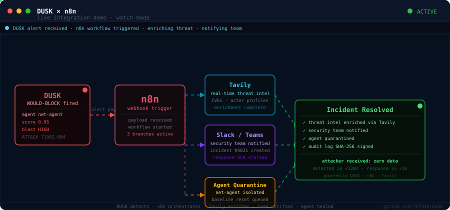

<h1 align="center">DUSK</h1>

<p align="center">
  <strong>Behavioural threat detection for agentic networks</strong><br>
  The missing security layer between AI agents and your infrastructure
</p>

<p align="center">
  <a href="https://github.com/TFT444/DUSK/actions/workflows/dusk.yml"></a>
  <a href="LICENSE"></a>
  <a href="https://www.python.org/"></a>
  <a href="https://attack.mitre.org/"></a>
  <a href="https://github.com/TFT444/DUSK"></a>
</p>

<p align="center">
  <em>Credentials verify identity. DUSK verifies behaviour.</em>
</p>

---

> **Independently validated in the last 30 days**
>
> [Anthropic Frontier Red Team (3 Jun 2026)](https://www.anthropic.com/research/frontier-red-team-mapping-ai-enabled-cyber-threats) — autonomous killchain orchestration is the #1 AI threat; MITRE ATT&CK has no taxonomy for it yet.
>
> [Google DeepMind AI Control Roadmap (18 Jun 2026)](https://deepmind.google/blog/securing-the-future-of-ai-agents/) — runtime behavioural monitoring is the missing security layer.
>
> **DUSK is the open-source implementation of that missing layer.**

---

<p align="center">
  
</p>

<p align="center"><sub>A network agent reads a poisoned web page, a hidden prompt injection hijacks it into opening a firewall path into the restricted segment, and DUSK refuses the action before it reaches the controller. DUSK simultaneously fires Gemini Flash (plain-English briefing), Attio CRM (incident record), n8n SOAR (security team alert), and Superlinked (similarity search) -- all in under 2 seconds.</sub></p>

<p align="center">
  <strong>Interactive demo:</strong> open <code>demo/live_demo.html</code> in a browser for an animated walkthrough of the full 6-phase attack and response pipeline. No server required.
</p>

<details>
<summary><b>Contents</b></summary>

- [The problem](#the-problem)
- [Detection in action](#detection-in-action)
- [What it detects](#what-it-detects)
- [Architecture](#architecture)
- [Quickstart](#quickstart)
- [Roadmap](#roadmap)
- [Where DUSK sits](#where-dusk-sits-in-the-enterprise-stack)
- [References](#references)

</details>

---

## The problem

Every security control built so far assumes the decision-maker is a human. AI agents are not human. They act at machine speed, they hold valid credentials, and almost nothing watches what they actually do with those credentials.

An LLM gateway such as AWS Bedrock tells you what an agent is permitted to request. A SIEM such as Microsoft Sentinel tells you what infrastructure events occurred. Neither tells you whether an agent is behaving normally -- or whether it has been compromised mid-task by a prompt injection, a scope drift, or an impersonation.

At agentic scale, that blind spot is where the damage happens:

| Attack | What happens | Why existing controls miss it |
|---|---|---|
| Prompt injection | An agent reads malicious content and overrides its own task | Credentials are valid; each action looks individually legitimate |
| Agent impersonation | A compromised agent feeds false instructions to another as if from the orchestrator | No inter-agent verification or signing |
| Scope creep | An agent with read scope begins writing and deleting | Each permission check passes; only the behavioral pattern is wrong |

DUSK closes this gap. It is **complementary** to every platform above, not a competitor.

---

## Detection in action

### Live prompt-injection scenario

The animation at the top of this README is the real demo (`python demo/live_attack.py`). A network operations agent reads a web page and acts on the instructions it finds. On a clean page it does its routine job and DUSK allows it. On a poisoned page, a hidden prompt injection hijacks the agent into opening a firewall path from the guest segment into the restricted segment -- and DUSK refuses that action before it reaches the controller.

Pass a real URL with `TAVILY_API_KEY` set and DUSK fetches live content via Tavily instead of the canned pages, so the demo can run on genuinely fresh data without any code changes.

### Batch gate evaluation

```text
$ dusk gate --baseline lab/actions/actions_normal.json \
            --check lab/actions/actions_mixed.json

ALLOW       netops-agent   route_change         rt-corp-default         score=0.00 blast=low
ALLOW       iam-agent      role_assignment      ra-iam-readonly         score=0.00 blast=low
ALLOW       segment-agent  segment_change       seg-corporate           score=0.00 blast=low
...
WOULD-BLOCK segment-agent  firewall_rule_change fw-restricted-to-all    score=0.95 blast=high
            ATT&CK T1562.004 Impair Defenses: Disable or Modify System Firewall
            ATLAS  AML.T0051 LLM Prompt Injection
            reason action type 'firewall_rule_change' is new for this agent
            next   expect lateral movement into the newly reachable segment
WOULD-BLOCK iam-agent      role_assignment      ra-iam-owner-self       score=0.80 blast=high
            ATT&CK T1098 Account Manipulation
            ATLAS  AML.T0051 LLM Prompt Injection
            reason newly introduces sensitive or privileged terms ['owner', 'self']
            next   expect privilege use; watch for actions the new role permits

GATE evaluated 18 action(s), refused 3.
```

The gate scores 1.0 precision, 1.0 recall, and 0.0 false-positive rate on the bundled benchmark (`test_benchmark_precision_recall`).

### Network sweep detection

```text
$ dusk scan --file capture.pcap

╭───────────────────────── DUSK ALERT ─────────────────────────╮
│ Source IP         10.0.40.2                                    │
│ Detection         sweep                                        │
│ MITRE ATT&CK      T1046                                        │
│ Kill-chain stage  Reconnaissance                               │
│ Confidence        53%                                          │
│ Next stage        Expect LateralMovement. Watch for east-west  │
│                   connections into segments this host has      │
│                   never talked to.                             │
╰───────────────────────────────────────────────────────────────╯
VERDICT: ALERT, analysed 25 packets, 1 detection(s) fired.
```

---

## What it detects

| Detection | Behavior | MITRE | Layer | Status |
|---|---|---|---|---|
| Prompt injection via behavioral drift | Agent's actions diverge from its own normal pattern after reading external content | AML.T0051 + T1562.004 | Control plane | Shipped |
| Privilege escalation | Agent introduces sensitive roles or access values it has never used | T1098 | Control plane | Shipped |
| Scope creep | Agent performs a verb category it has never used before | T1078 | Control plane | Shipped |
| Network sweep | Machine-paced scan across many destinations | T1046 | Data plane | Shipped |
| Boundary probe | Port scan against a single destination | T1590 | Data plane | Shipped |

Each detection returns a confidence or anomaly score, blast radius estimate, MITRE ATT&CK and ATLAS mappings, and a prediction of the attacker's next move.

---

## How it works

**Behavioral baseline.** DUSK learns what each individual agent normally does: which action types it performs, which target classes it touches, which tokens and change values it introduces. This is per-agent, not per-role.

**Anomaly scoring.** When a new action arrives, DUSK computes a weighted anomaly score across novelty signals: new action type, new target class, new tokens, new change values, and newly introduced sensitive terms. Weights are explicit; the computation is deterministic and dependency-free.

**Verdict rendering.** Actions above the configured threshold receive ALLOW, WOULD-BLOCK, or BLOCK with full reasoning, MITRE mappings, blast radius, and a prediction of what an attacker would do next. Watch mode never blocks; enforce mode upgrades WOULD-BLOCK to BLOCK once the baseline is trusted.

---

## Architecture

### Enterprise system architecture

<p align="center">
  
</p>

<p align="center"><sub>The animation runs three phases. Phase 1: a clean agent operates normally. Phase 2: a threat actor poisons a web page, the agent is hijacked, and the anomalous action flows straight to the controller — the network is breached. Phase 3: DUSK is active; the same attack arrives, the gate scores it 0.95, and the action is refused before it reaches the controller.</sub></p>

For the full layered design and integration notes, see [docs/ARCHITECTURE.md](docs/ARCHITECTURE.md).

### n8n integration demo

<p align="center">
  
</p>

<p align="center"><sub>DUSK fires a WOULD-BLOCK alert → n8n webhook receives the payload → three parallel tracks: Tavily enriches the threat in real time, the security team is notified, and the compromised agent is quarantined. Run: <code>python demo/live_attack.py</code> then trigger the n8n workflow from <code>demo/n8n_workflow.json</code>.</sub></p>

---

## Where DUSK sits in the enterprise stack

| Platform | Layer | Covers | Leaves open |
|---|---|---|---|
| AWS Bedrock | LLM gateway | Access control and audit for model calls | No baseline of an agent's downstream behavior |
| Microsoft Sentinel | SIEM | Infrastructure detection and analytics | No per-agent action baseline at the control plane |
| Cisco and network tooling | Network | Traffic flows at OSI layers 3 to 7 | No agent or action context |
| Oracle SQL Firewall | Database | Query allow-listing and audit at the database | Downstream of the agent's decision |
| Google DeepMind agent security | Research | Frameworks for controlling agents | A research direction, not a deployable control |
| **DUSK** | **Control plane + network** | **Per-agent behavioral monitoring of actions** | **The gap the others leave** |

> Oracle protects the database from bad queries. DUSK protects the database from good queries made by bad agents.

### Why not SIEM or access control?

Every tool above asks one question: **is this agent allowed to do this?** DUSK asks a different question: **does this agent normally do this?** Those are not the same question, and they have different answers when an agent is compromised.

A prompt-injected agent has valid credentials. Its token has not changed. The LLM gateway sees a permitted request. The SIEM sees a permitted API call. Every authorization check passes -- because the agent is who it says it is, it just no longer wants what it used to want.

SIEM rules fire on known-bad signatures. A behavioral baseline fires on anything that deviates from known-good, whether or not the attacker's technique has been seen before.

**Credentials verify identity. DUSK verifies behaviour.**

---

## Quickstart

```bash
git clone https://github.com/TFT444/DUSK.git
cd DUSK
pip install -e ".[dev]"

# Run the live prompt-injection demo
python demo/live_attack.py

# Gate a batch of actions
dusk gate --baseline lab/actions/actions_normal.json \
          --check lab/actions/actions_mixed.json

# Scan a packet capture
dusk scan --file tests/fixtures/attack_sweep.pcap
```

---

## Live Dashboard -- Full End-to-End Demo

DUSK ships with a real-time security operations dashboard and a Flask API that wires all partner integrations together.

### Partner integrations (live)

| Partner | Role | What DUSK does |
|---------|------|----------------|
| **Attio** | CRM hub | Auto-creates a CRM incident on every WOULD-BLOCK; closes it on self-heal; pushes research scores back as company notes |
| **Gemini 2.5 Flash** | AI reasoning | Produces a plain-English threat explanation for every alert |
| **n8n** | SOAR automation | Webhook fires on every alert; n8n routes to security team and enriches the record |
| **Superlinked** | Vector search | 384-dim semantic embeddings surface similar past decisions |
| **DuckDuckGo** | Threat intel | Free real-time web search for MITRE enrichment (no API key needed) |

### Setup

```bash
# 1. Clone and install
git clone https://github.com/TFT444/DUSK.git
cd DUSK
pip install -e ".[dev]"

# 2. Configure integrations -- copy and fill in your keys
cp .env.example .env   # edit with your GEMINI_API_KEY, ATTIO_API_KEY, N8N_WEBHOOK_URL,
                       # SUPERLINKED_API_KEY, SUPERLINKED_ENDPOINT

# 3. Verify all integrations before demo
python demo/preflight.py   # must show 6 PASS

# 4. Start the API server
flask --app dusk.api run --port 5000

# 5. Serve the frontend (separate terminal)
python3 -m http.server 8081 --directory demo
```

Open `http://localhost:8081/index.html` in Chrome.

### Environment variables

| Variable | Required | Description |
|----------|----------|-------------|
| `GEMINI_API_KEY` | Yes | Google AI Studio key (ai.google.dev) |
| `ATTIO_API_KEY` | Yes | Attio workspace API key (app.attio.com/settings/api) |
| `N8N_WEBHOOK_URL` | Yes | Production webhook URL from your n8n workflow |
| `SUPERLINKED_API_KEY` | Yes | Superlinked cluster key |
| `SUPERLINKED_ENDPOINT` | Yes | Superlinked cluster endpoint URL |
| `TAVILY_API_KEY` | No | Falls back to DuckDuckGo automatically if not set |

### API endpoints

| Endpoint | Method | Description |
|----------|--------|-------------|
| `/health` | GET | Server health and decision count |
| `/api/alert` | POST | Record a security verdict -- triggers Gemini, n8n, Attio, Superlinked |
| `/api/decisions` | GET | All recorded decisions |
| `/api/decisions/<id>/heal` | POST | Trigger self-healing -- closes Attio incident |
| `/research` | POST | Research a company via Gemini + DuckDuckGo -- pushes score to Attio |
| `/research/decisions` | GET | All research results |
| `/attio/trigger` | POST | Attio webhook -- receives company name, fires research in background |

### Alert payload

```json
{
  "agent_id": "netops-agent",
  "action": "firewall_rule_change",
  "score": 0.92,
  "verdict": "WOULD-BLOCK",
  "mitre": "T1562.004",
  "blast_radius": "HIGH",
  "reasoning": "opens guest-to-restricted segment",
  "predicted_next": "lateral movement",
  "decision_id": "demo-001"
}
```

DUSK responds with a Gemini explanation, Attio note ID, n8n delivery status, and Superlinked similarity results synchronously.

### Attio CRM -- bidirectional flow

```
New company in Attio
  --> POST /attio/trigger {"company": "Acme Corp"}
  --> DUSK researches via Gemini + DuckDuckGo
  --> Score pushed as note on Attio company record

Agent WOULD-BLOCK
  --> DUSK calls create_incident() on "DUSK Security Hub" company
  --> n8n webhook fires in parallel
  --> Self-heal --> incident marked closed in Attio
```

---

## Usage

```text
dusk --help
dusk --version

# Control-plane gate
dusk gate --baseline <known-good.json> --check <to-evaluate.json>
dusk gate --baseline <path> --check <path> --enforce   # block instead of warn
dusk gate --baseline <path> --check <path> --json      # machine-readable output

# Agent action ingest
dusk actions --file <actions.json> --source <name>
dusk actions --file <path> --source azure --json

# Network layer
dusk scan --file <capture.pcap>
dusk scan --file <path> --json
dusk watch --interface <iface>      # live capture (coming in v0.2)
```

`--verbose` raises the root logger to DEBUG and writes structured log lines to stderr, keeping machine output on stdout clean.

---

## JSON output

`dusk gate --json` prints a stable machine-readable document. One entry appears per evaluated action.

```json
{
  "baseline": "lab/actions/actions_normal.json",
  "check": "lab/actions/actions_mixed.json",
  "actions_evaluated": 18,
  "refused": 3,
  "results": [
    {
      "verdict": "ALLOW",
      "refused": false,
      "analysis": {
        "agent_id": "netops-agent",
        "action_type": "route_change",
        "target": "rt-corp-default",
        "score": 0.0,
        "reasons": ["action matches the agent's established pattern"],
        "mitre_attack": "T1078 Valid Accounts",
        "mitre_atlas": "AML.T0051 LLM Prompt Injection",
        "blast_radius": "low",
        "predicted_next": "watch this agent for further actions outside its established pattern"
      }
    }
  ]
}
```

On an input error the document is `{"error": "..."}` and the exit code is 2.

---

## Exit codes

| Code | Meaning |
|---|---|
| 0 | Clean -- no action refused (gate), or no detection fired (scan) |
| 1 | Alert -- at least one action refused or one detection fired |
| 2 | Input error -- missing, empty, or unreadable file |

---

## Configuration

All thresholds are configurable. Copy `dusk.yaml.example` to `dusk.yaml` in your working directory, or override any value with a `DUSK_*` environment variable.

| Setting | Default | Environment variable |
|---|---|---|
| Gate block threshold | 0.6 | `DUSK_GATE_BLOCK_THRESHOLD` |
| Sweep threshold (unique destinations) | 15 | `DUSK_SWEEP_THRESHOLD` |
| Sweep window in seconds | 10.0 | `DUSK_SWEEP_WINDOW_SECONDS` |
| Sweep timing std threshold | 0.05 | `DUSK_SWEEP_TIMING_STD_THRESHOLD` |
| Boundary port threshold | 10 | `DUSK_BOUNDARY_PORT_THRESHOLD` |
| Boundary window in seconds | 30.0 | `DUSK_BOUNDARY_WINDOW_SECONDS` |
| Alert log path | dusk-alerts.json | `DUSK_ALERT_LOG_PATH` |
| Log level | WARNING | `DUSK_LOG_LEVEL` |

---

## Project layout

```text
src/dusk/
  cli.py                Command-line interface (Click)
  config.py             Configuration: defaults, dusk.yaml, DUSK_* env vars
  actions/
    event.py            AgentAction canonical event schema
    adapters/           Source-specific adapters (azure, generic)
    normaliser.py       Adapter registry keyed by source name
    ingest.py           ingest_file: reads JSON, normalises, skips malformed
    baseline.py         Per-agent behavioral baseline (learn, observe, profile)
    analyse.py          Anomaly scoring, blast radius, MITRE mapping, next-stage prediction
    verdict.py          ALLOW / WOULD-BLOCK / BLOCK rendering (ActionGate)
  core/
    engine.py           Detection runner and verdict
    kill_chain.py       Kill-chain stage prediction
  detections/           One module per network behavioral detection
  sensor/               Traffic sources (pcap; live and Zeek next)
  respond/              Responders (alert log; isolation next)
demo/
  live_demo.html        Interactive animated demo -- 6-phase prompt injection + pipeline response
  index.html            Live security operations dashboard (Security Gate + Research Pipeline)
  live_attack.py        End-to-end terminal scenario (DuckDuckGo + Attio)
  preflight.py          Pre-demo smoke test -- verifies all 6 integrations
  seed_attio.py         Seeds Attio with demo companies and incidents
  DEMO_GUIDE.md         Timed 2-min video script and 5-min finalist guide
lab/
  actions/              Action fixture generators (normal + out-of-pattern)
  scenarios/            pcap generators for network fixture data
tests/                  Unit, edge-case, benchmark, and end-to-end tests
docs/                   Architecture, threat model, and operational docs
```

---

## Development

```bash
pip install -e ".[dev]"
pre-commit install

# Individual checks (all run in CI)
ruff check src/ tests/ demo/
ruff format --check src/ tests/ demo/
mypy src/dusk/
bandit -r src/ -ll
pip-audit -r requirements.txt
pytest --cov=src/dusk --cov-report=term-missing
```

CI runs on every push and pull request to `dev` and `main`. All gates must pass before merge.

---

## Roadmap

### Shipped

| Layer | What it does | Status |
|---|---|---|
| v0.1 -- Network detection | Sweep (T1046) and boundary probe (T1590) over packet captures | Released |
| v1.1 -- Action ingest | Normalise agent control-plane actions into a controller-agnostic AgentAction event | Landed |
| v1.2 -- Baseline | Per-agent behavioral baseline: action types, target classes, token vocabulary, change values | Landed |
| v1.3 -- Analyse | Weighted anomaly scoring, MITRE ATT&CK + ATLAS mapping, blast radius, next-stage prediction | Landed |
| v1.4 -- Verdict gate | ALLOW / WOULD-BLOCK / BLOCK with full reasoning. Watch mode by default; enforce mode on trust. | Landed |

### In progress

| Layer | What it does |
|---|---|
| v1.5 -- Vector baseline | Embedding-based behavioral similarity (Superlinked-compatible) as an optional drop-in |
| v2 -- Data plane | Reposition packet and flow detections as a confirmation layer |

### Direction

| Layer | What it does |
|---|---|
| v3 -- Reasoning layer | Inspect agent decision and tool-call reasoning to catch intent before the action is formed |
| v4 -- Isolation | Automated containment: quarantine a suspicious agent while preserving audit evidence |

DUSK ships in watch mode first. An inline gate that wrongly blocks a legitimate action can disrupt a network, so the gate observes and reports until its baseline is trusted in a given environment.

---

## References

- [Anthropic Frontier Red Team: Mapping AI-enabled cyber threats](https://www.anthropic.com/research/frontier-red-team-mapping-ai-enabled-cyber-threats) -- 832 threat actors analysed; autonomous killchain orchestration identified as highest-risk AI threat with no existing MITRE taxonomy
- [Google DeepMind: securing AI agents](https://deepmind.google/blog/securing-the-future-of-ai-agents/) -- the case for behavior-level controls on agents
- [MITRE ATT&CK](https://attack.mitre.org/) -- enterprise and network techniques
- [MITRE ATLAS](https://atlas.mitre.org/) -- adversarial threats to AI systems
- [Superlinked](https://superlinked.com/) -- vector embedding infrastructure compatible with DUSK v1.5 baseline
- [Tavily](https://tavily.com/) -- real-time web search API used in the live demo and n8n integration
- [n8n](https://n8n.io/) -- AI agent workflow orchestration used in the integration demo
- [Aikido Security](https://aikido.dev/) -- runtime security scanning integrated into DUSK CI
- [OWASP Top 10 for Agentic Applications](https://owasp.org/projects/) -- agentic application security
- Threat model and MITRE mappings: [docs/threat-model.md](docs/threat-model.md)
- Oracle integration notes: [docs/ORACLE-INTEGRATION.md](docs/ORACLE-INTEGRATION.md)

---

## Team

| | Name | Role |
|---|---|---|
| [](https://github.com/TFT444) | [Tanvir Farhad](https://linkedin.com/in/tanvir-farhad-466940307) | Lead -- architecture, detection engine, partner integrations |
| [](https://github.com/ritiksah141) | [ritiksah141](https://github.com/ritiksah141) | Agent research pipeline, Flask API, live demo |
| [](https://github.com/HXIAOSHAW) | [HXIAOSHAW](https://github.com/HXIAOSHAW) | Contributor |

---

## License

Apache-2.0. See [LICENSE](LICENSE) for details.

---

<p align="center">
  Built by <a href="https://linkedin.com/in/tanvir-farhad-466940307">Tanvir Farhad</a>,
  <a href="https://github.com/ritiksah141">ritiksah141</a> and
  <a href="https://github.com/HXIAOSHAW">HXIAOSHAW</a>
  · ShieldTech Ltd · London
</p>
