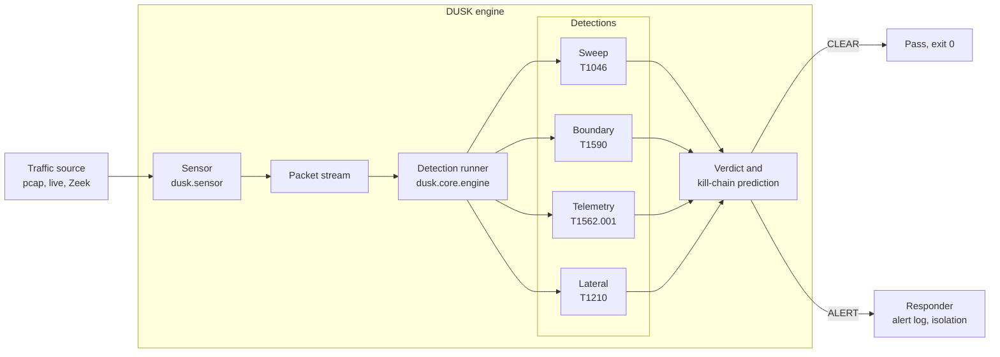

# DUSK

[](https://github.com/TFT444/DUSK/actions/workflows/dusk.yml)
[](LICENSE)
[](https://www.python.org/)
[](https://attack.mitre.org/)
[](https://owasp.org/projects/)
[](https://github.com/TFT444/DUSK/releases)

> **Inline agent-action security for networks. DUSK analyses every action an AI agent takes on your infrastructure, predicts its impact, and blocks the hijacked ones before they execute.**

Behavioural threat detection for agentic networks. DUSK sits at the control plane, watches every action an AI agent takes before execution, and blocks the hijacked ones before they reach your infrastructure.

---

Networks are filling with AI agents that operate autonomously, changing routing,
modifying firewall rules, and reconfiguring infrastructure at machine speed. When
one of those agents is hijacked or poisoned, the attacker does not breach the
network. They command the network's own brain to breach it for them, through
actions that look completely legitimate.

Dusk sits between your network and the agents that operate it. It detects the
machine-paced systematic patterns that signal an attack in progress, predicts
what stage the attacker is targeting next, and stops it before it lands.

### Where Dusk is heading

The packet detections above are the proven foundation. The direction is larger:
Dusk is becoming an inline decision gate for the actions agents take on a
network, not only the traffic they produce.

A hijacked agent does its damage by issuing commands through a control-plane
API: open this firewall rule, change this route, reassign this segment. That API
call is the one place the agent states exactly what it intends, in full, before
it happens, and early enough to refuse. An attacker can encrypt traffic and
delete logs, but cannot avoid the API call, because the API call is the attack.

So Dusk is growing from watching traffic toward watching actions: analyse the
requested action, predict its impact, allow or block it before it executes, and
report the full decision. Detection becomes prevention. The packet engine
remains, repositioned as the layer that confirms what an agent's command
actually did on the wire.

## Contents

- [Detection in action](#detection-in-action)
- [What it detects](#what-it-detects)
- [How it works](#how-it-works)
- [Architecture](#architecture)
- [The control plane is the network](#the-control-plane-is-the-network)
- [Quickstart](#quickstart)
- [Usage](#usage)
- [JSON output](#json-output)
- [Exit codes](#exit-codes)
- [Use in CI](#use-in-ci)
- [Alerts](#alerts)
- [Try it with the bundled lab scenarios](#try-it-with-the-bundled-lab-scenarios)
- [Configuration](#configuration)
- [Install from source](#install-from-source)
- [Project layout](#project-layout)
- [Development](#development)
- [Roadmap](#roadmap)
- [Threat model](#threat-model)
- [Contributing](#contributing)
- [References](#references)
- [License](#license)

## Detection in action

```text
$ dusk scan --file capture.pcap

╭───────────────────────────────── DUSK ALERT ─────────────────────────────────╮
│ Source IP         10.0.40.2                                                    │
│ Detection         sweep                                                        │
│ MITRE ATT&CK      T1046                                                        │
│ Kill-chain stage  Reconnaissance                                              │
│ Confidence        53%                                                          │
│ Next stage        After Reconnaissance, expect LateralMovement next. Watch     │
│                   for east-west connections into segments this host has        │
│                   never talked to.                                             │
│ Reason            Source 10.0.40.2 contacted 16 unique destinations within     │
│                   10s with machine-regular timing (interval std=0.0000s).      │
│                   Looks like an automated network sweep.                       │
╰───────────────────────────────────────────────────────────────────────────────╯
VERDICT: ALERT, analysed 25 packets, 1 detection(s) fired.
```

```text
$ dusk scan --file normal.pcap

VERDICT: CLEAR, analysed 20 packets, nothing suspicious.
```

## What it detects

| Detection | Behaviour | MITRE Technique | Kill-chain Stage | Status |
|---|---|---|---|---|
| Sweep | Machine-paced scan across many destinations | T1046 | Reconnaissance | v0.1 |
| Boundary probe | Port scan against a single destination | T1590 | Reconnaissance | v0.1 |
| Telemetry silence | Agent stops expected flows without warning | T1562.001 | Defence Evasion | v0.2 |
| Lateral movement | East-west connections across segments | T1210 | Lateral Movement | v0.2 |

Each detection returns a confidence score and the predicted next kill-chain stage,
so operators know what to watch for, not just what fired.

## How it works

Dusk classifies behaviour, not identity. A hijacked agent uses credentials and
paths that are entirely authorised, so signature and identity controls see
nothing wrong. What gives it away is the shape of the traffic.

- **Machine pacing.** Automated activity arrives at near-constant intervals.
  Dusk measures the standard deviation of inter-packet timing; a value near zero
  is a strong signal of automation rather than a human operator.
- **Systematic fan-out.** Reconnaissance touches many destinations or many ports
  in a short window. Dusk counts unique destinations per source (sweep) and
  unique ports per source-destination pair (boundary) inside sliding windows.
- **Kill-chain context.** When a detection fires, Dusk maps it to a kill-chain
  stage and predicts the next stage, turning a single alert into forward-looking
  guidance for the responder and the analyst.

Every threshold is configurable, so the same engine tunes from a noisy lab to a
quiet production segment without code changes.

## Architecture



Simplified component view:



The architecture is layered and pluggable. Sensors are swappable. Detections are
independent classes that return a `DetectionResult` with verdict, reason, MITRE
technique, and confidence. New detections drop in without touching the engine.

## The control plane is the network

A modern agent does not log into a router and type commands. It calls a
controller: a cloud network API, an SDN controller, a network policy endpoint.
When an agent changes a security group, a route table, or a firewall rule
through that API, it is performing a network action.

This is why Dusk's forward work begins at the control-plane API rather than the
packet. The API is a chokepoint the attacker cannot route around, it carries the
agent's intent in full, and it is reachable early enough to block. Cloud-native
environments expose this chokepoint today, which makes them the first place Dusk
can stand inline. The analysis is controller-agnostic by design: an action is
"an agent changed a network rule," whatever system it came from.

## Quickstart

Requirements: Python 3.11 or newer.

```bash
pip install dusk-security

dusk scan --file capture.pcap
```

`dusk scan` exits 0 on CLEAR and 1 on ALERT, so it works as a native CI gate.

## Usage

```text
dusk --help                         Show top-level help
dusk --version                      Print the installed version
dusk scan --file <path.pcap>        Analyse a pcap and print a verdict
dusk scan --file <path> --json      Emit machine-readable JSON
dusk scan --file <path> --verbose   Add DEBUG logging on stderr
dusk watch --interface <iface>      Live capture (coming in v0.2)
```

`--verbose` raises the root logger to DEBUG and writes structured log lines to
stderr, so you can pipe machine output on stdout and diagnostics on stderr
independently.

## JSON output

`--json` prints a stable, machine-readable document on stdout and suppresses the
formatted panel. One entry appears per registered detection.

```json
{
  "file": "tests/fixtures/attack_sweep.pcap",
  "packets_analysed": 25,
  "verdict": "ALERT",
  "results": [
    {
      "passed": false,
      "reason": "Source 10.0.40.2 contacted 16 unique destinations within 10s with machine-regular timing (interval std=0.0000s). Looks like an automated network sweep.",
      "mitre": "T1046",
      "stage": "Reconnaissance",
      "confidence": 0.5333,
      "source": "10.0.40.2"
    },
    {
      "passed": true,
      "reason": null,
      "mitre": "T1590",
      "stage": "Reconnaissance",
      "confidence": 0.0,
      "source": null
    }
  ]
}
```

On an input error such as a missing file, the JSON document is `{"error": "..."}`
and the exit code is 2.

## Exit codes

| Code | Meaning |
|---|---|
| 0 | CLEAR, no detection fired |
| 1 | ALERT, at least one detection fired |
| 2 | Input error, for example a missing, empty, or unreadable pcap |

## Use in CI

Because the exit code encodes the verdict, `dusk scan` drops straight into a
pipeline as a gate. Example GitHub Actions step:

```yaml
- name: Scan captured traffic with Dusk
  run: |
    pip install dusk-security
    dusk scan --file artifacts/capture.pcap
```

The job fails if Dusk raises an ALERT. Add `--json` and archive the output if you
want a machine-readable record per run.

## Alerts

When a detection fires, the responder prints the alert panel and appends a JSON
entry to an alert log so findings accumulate across runs. The default path is
`dusk-alerts.json` in the current working directory.

```json
[
  {
    "timestamp": "2026-06-07T09:00:00+00:00",
    "detection": "sweep",
    "source": "10.0.40.2",
    "mitre": "T1046",
    "stage": "Reconnaissance",
    "confidence": 0.5333,
    "reason": "Source 10.0.40.2 contacted 16 unique destinations ...",
    "prediction": "After Reconnaissance, expect LateralMovement next. ..."
  }
]
```

Relocate it with the `alert_log_path` setting or the `DUSK_ALERT_LOG_PATH`
environment variable.

## Try it with the bundled lab scenarios

```bash
python lab/scenarios/attack_sweep.py
python lab/scenarios/port_scan.py
python lab/scenarios/normal_traffic.py

dusk scan --file tests/fixtures/attack_sweep.pcap
dusk scan --file tests/fixtures/port_scan.pcap
dusk scan --file tests/fixtures/normal_traffic.pcap
```

Expected: the attack_sweep fixture raises an ALERT for T1046, the port_scan
fixture raises an ALERT for T1590, and normal_traffic is CLEAR.

## Configuration

All thresholds are configurable. Copy `dusk.yaml.example` to `dusk.yaml` in your
working directory, or override any value with a `DUSK_*` environment variable.
Precedence is defaults, then `dusk.yaml`, then environment variables.

| Setting | Default | Environment variable |
|---|---|---|
| Sweep threshold (unique destinations) | 15 | `DUSK_SWEEP_THRESHOLD` |
| Sweep window in seconds | 10.0 | `DUSK_SWEEP_WINDOW_SECONDS` |
| Sweep timing std threshold | 0.05 | `DUSK_SWEEP_TIMING_STD_THRESHOLD` |
| Boundary port threshold | 10 | `DUSK_BOUNDARY_PORT_THRESHOLD` |
| Boundary window in seconds | 30.0 | `DUSK_BOUNDARY_WINDOW_SECONDS` |
| Alert log path | dusk-alerts.json | `DUSK_ALERT_LOG_PATH` |
| Log level | WARNING | `DUSK_LOG_LEVEL` |

## Install from source

```bash
git clone https://github.com/TFT444/DUSK.git
cd DUSK
pip install -e ".[dev]"
```

This installs Dusk in editable mode with the development extras (test, lint,
type-check, and security tooling).

## Project layout

```text
src/dusk/
  cli.py            Command-line interface (Click)
  config.py         Configuration: defaults, dusk.yaml, DUSK_* env vars
  core/
    engine.py       Detection runner and verdict
    kill_chain.py   Kill-chain stage prediction
  detections/       One module per behavioral detection
  sensor/           Traffic sources (pcap now; live and Zeek next)
  respond/          Responders (alert now; isolation next)
lab/scenarios/      Generators for the pcap fixtures
tests/              Unit, edge-case, and end-to-end tests
docs/               Threat model and operational docs
```

## Development

```bash
pip install -e ".[dev]"

ruff check src/ tests/
ruff format --check src/ tests/
mypy src/dusk/
bandit -r src/ -ll
pip-audit -r requirements.txt
pytest --cov=src/dusk --cov-report=term-missing
pre-commit install
```

CI runs on every push and pull request to `dev` and `main`. The lint, typecheck,
security, and test jobs must all pass before merge. See
[CONTRIBUTING.md](CONTRIBUTING.md) for the full workflow.

## Roadmap

Shipped:

| Version | Focus |
|---|---|
| v0.1 | Sweep and boundary detection, pcap sensor, CLI, configurable thresholds |

Direction. Dusk is built one layer at a time. Each layer ships and proves itself
before the next begins.

| Version | Layer | What it does |
|---|---|---|
| v1 | Agent action layer (control plane) | Ingest agent control-plane actions, learn per-agent baselines, analyse, predict, and render verdicts in watch mode. Cloud control-plane actions are the first source. |
| v2 | Data plane | Reposition the packet and flow detections as a confirmation layer, correlating what an agent commanded with what the network actually did. |
| v3 | Reasoning layer | Inspect the agent's decision and tool-call reasoning to catch intent before the action is even formed. |

The v1 layer is built in sub-stages:

| Stage | Scope |
|---|---|
| v1.1 | Ingest, normalise agent actions into a controller-agnostic AgentAction event |
| v1.2 | Baseline, learn each agent's normal action fingerprint |
| v1.3 | Analyse and predict, score actions, estimate blast radius, predict next stage |
| v1.4 | Verdict and report, render ALLOW or WOULD-BLOCK with full reasoning and MITRE mapping |

Dusk ships in watch mode first. It renders a verdict on every action but does not
enforce until its analysis is trusted in a given environment, because an inline
gate that wrongly blocks a legitimate action can disrupt a network.

## Threat model

Detection categories and their MITRE ATT&CK and MITRE ATLAS mappings are
documented in [docs/threat-model.md](docs/threat-model.md).

## Contributing

All work goes through pull requests. See [CONTRIBUTING.md](CONTRIBUTING.md) for the
branch model and PR conventions. Report vulnerabilities privately via
[GitHub Security Advisories](https://github.com/TFT444/DUSK/security/advisories).
See [SECURITY.md](SECURITY.md) for the full disclosure process.

## References

- [MITRE ATT&CK](https://attack.mitre.org/) for enterprise and network techniques
- [MITRE ATLAS](https://atlas.mitre.org/) for adversarial threats to AI systems
- [OWASP](https://owasp.org/) and its work on agentic application security

## License

Apache-2.0. See [LICENSE](LICENSE) for details.
