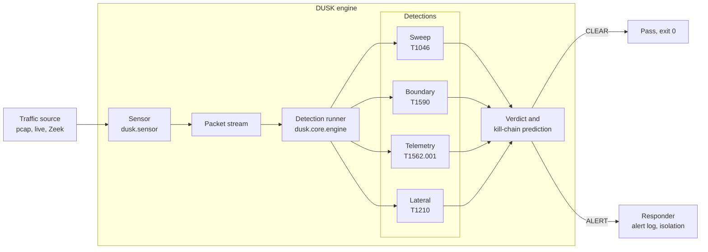

# DUSK

[](https://github.com/TFT444/DUSK/actions/workflows/dusk.yml)
[](LICENSE)
[](https://www.python.org/)
[](https://attack.mitre.org/)
[](https://owasp.org/projects/)
[](https://github.com/TFT444/DUSK/releases)

**Behavioral threat detection for agentic networks: catch AI agent attacks before they complete.**

Networks are filling with AI agents that operate autonomously, changing routing,
modifying firewall rules, and reconfiguring infrastructure at machine speed. When
one of those agents is hijacked or poisoned, the attacker does not breach the
network. They command the network's own brain to breach it for them, through
actions that look completely legitimate.

Dusk sits between your network and the agents that operate it. It detects the
machine-paced systematic patterns that signal an attack in progress, predicts
what stage the attacker is targeting next, and stops it before it lands.

## Detection in action

```text
$ dusk scan --file capture.pcap

╭───────────────────────────────── DUSK ALERT ─────────────────────────────────╮
│ Source IP         10.0.40.2                                                    │
│ Detection         sweep                                                        │
│ MITRE ATT&CK      T1046                                                        │
│ Kill-chain stage  Reconnaissance                                              │
│ Confidence        53%                                                          │
│ Next stage        After Reconnaissance, expect LateralMovement next. Watch     │
│                   for east-west connections into segments this host has        │
│                   never talked to.                                             │
│ Reason            Source 10.0.40.2 contacted 16 unique destinations within     │
│                   10s with machine-regular timing (interval std=0.0000s).      │
│                   Looks like an automated network sweep.                       │
╰───────────────────────────────────────────────────────────────────────────────╯
VERDICT: ALERT, analysed 25 packets, 1 detection(s) fired.
```

```text
$ dusk scan --file normal.pcap

VERDICT: CLEAR, analysed 20 packets, nothing suspicious.
```

## What it detects

| Detection | Behaviour | MITRE Technique | Kill-chain Stage | Status |
|---|---|---|---|---|
| Sweep | Machine-paced scan across many destinations | T1046 | Reconnaissance | v0.1 |
| Boundary probe | Port scan against a single destination | T1590 | Reconnaissance | v0.1 |
| Telemetry silence | Agent stops expected flows without warning | T1562.001 | Defence Evasion | v0.2 |
| Lateral movement | East-west connections across segments | T1210 | Lateral Movement | v0.2 |

Each detection returns a confidence score and the predicted next kill-chain stage,
so operators know what to watch for, not just what fired.

## Architecture



The architecture is layered and pluggable. Sensors are swappable. Detections are
independent classes that return a `DetectionResult` with verdict, reason, MITRE
technique, and confidence. New detections drop in without touching the engine.

## Quickstart

Requirements: Python 3.11 or newer.

```bash
pip install dusk-security

dusk scan --file capture.pcap
dusk scan --file capture.pcap --json
dusk scan --file capture.pcap --verbose
```

`dusk scan` exits 0 on CLEAR and 1 on ALERT, so it works as a native CI gate.

## Try it with the bundled lab scenarios

```bash
python lab/scenarios/attack_sweep.py
python lab/scenarios/port_scan.py
python lab/scenarios/normal_traffic.py

dusk scan --file tests/fixtures/attack_sweep.pcap
dusk scan --file tests/fixtures/port_scan.pcap
dusk scan --file tests/fixtures/normal_traffic.pcap
```

## Configuration

All thresholds are configurable. Copy `dusk.yaml.example` to `dusk.yaml` in your
working directory, or override any value with a `DUSK_*` environment variable.

| Setting | Default | Environment variable |
|---|---|---|
| Sweep threshold (unique destinations) | 15 | `DUSK_SWEEP_THRESHOLD` |
| Sweep window in seconds | 10.0 | `DUSK_SWEEP_WINDOW_SECONDS` |
| Sweep timing std threshold | 0.05 | `DUSK_SWEEP_TIMING_STD_THRESHOLD` |
| Boundary port threshold | 10 | `DUSK_BOUNDARY_PORT_THRESHOLD` |
| Boundary window in seconds | 30.0 | `DUSK_BOUNDARY_WINDOW_SECONDS` |
| Alert log path | dusk-alerts.json | `DUSK_ALERT_LOG_PATH` |
| Log level | WARNING | `DUSK_LOG_LEVEL` |

## Development

```bash
pip install -e ".[dev]"

ruff check src/ tests/
mypy src/dusk/
bandit -r src/ -ll
pip-audit -r requirements.txt
pytest --cov=src/dusk --cov-report=term-missing
pre-commit install
```

CI runs on every push and pull request to `dev` and `main`. The lint, typecheck,
security, and test jobs must all pass before merge.

## Roadmap

| Version | Focus |
|---|---|
| v0.1 | Sweep and boundary detection, pcap sensor, CLI, configurable thresholds |
| v0.2 | Telemetry silence and lateral movement, Zeek log support, live capture |
| v0.3 | Behavioral baseline learning, anomaly detection per agent identity |
| v0.4 | Active isolation response, segment quarantine |
| v0.5 | OWASP submission, threat-model contribution to agentic-security standards |

## Threat model

Detection categories and their MITRE ATT&CK and MITRE ATLAS mappings are
documented in [docs/threat-model.md](docs/threat-model.md).

## Contributing

All work goes through pull requests. See [CONTRIBUTING.md](CONTRIBUTING.md) for the
branch model and PR conventions. Report vulnerabilities privately via
[GitHub Security Advisories](https://github.com/TFT444/DUSK/security/advisories).
See [SECURITY.md](SECURITY.md) for the full disclosure process.

## License

Apache-2.0. See [LICENSE](LICENSE) for details.
